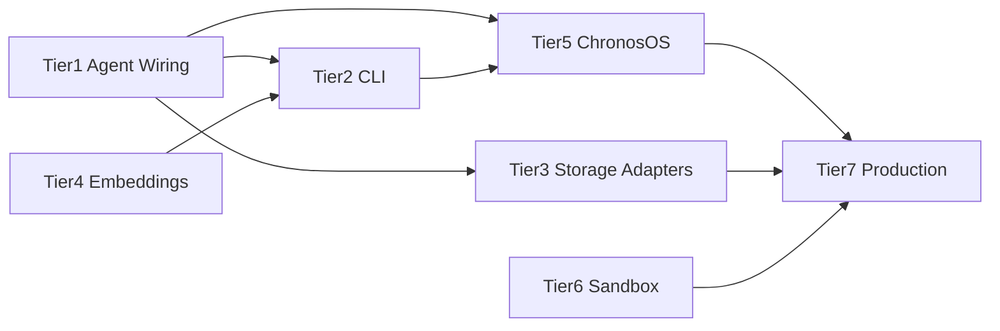

# Chronos Development Roadmap

This document defines the implementation roadmap for the Chronos Go framework. Work is organized into seven tiers. Execute tiers in order when possible; dependencies are noted below.

## Dependency and priority order

**Recommended order:** Tier 1 → Tier 4 → Tier 2 → Tier 5 → Tier 3 → Tier 6 → Tier 7.

---

## Tier 1 — Critical Agent Wiring

**Goal:** Use Knowledge, MemoryManager, OutputSchema, NumHistoryRuns, output guardrails, and hooks inside the agent's Chat and Run flows.

| Item | Location | Acceptance criteria |
|------|----------|---------------------|
| Wire Knowledge.Search into context | `sdk/agent/agent.go` | Before each LLM call in Chat/Run, if agent has Knowledge, call Search with current query (or state); append top-k results to system or user context. |
| Wire MemoryManager.GetUserMemories | `sdk/agent/agent.go` | When MemoryManager is set, call GetUserMemories for the session/user and prepend or append to system prompt. |
| Wire MemoryManager.ExtractMemories | `sdk/agent/agent.go` | After session/turn completion (e.g. in Run when graph finishes, or in Chat after final response), call ExtractMemories with message history. |
| Apply OutputSchema | `sdk/agent/agent.go` | When OutputSchema is set, pass response format (e.g. JSON) to model and/or validate/parse response against schema before returning. |
| Use NumHistoryRuns | `sdk/agent/agent.go` | When NumHistoryRuns > 0, load prior session messages (from storage) and include last N runs in context for the model. |
| Call output guardrails | `sdk/agent/agent.go` | After receiving model content (Chat and graph nodes that call the model), run output guardrail engine; reject or redact on failure. |
| Fire tool/model hooks | `sdk/agent/agent.go` | In Chat and in handleToolCalls, emit tool_call before/after and model_call before/after events to the hook chain. |

**Done when:** All seven items are implemented, `go build ./...` passes, and a quickstart run demonstrates memory/knowledge in context and guardrails applied.

---

## Tier 2 — CLI Expansion

**Goal:** Full CLI surface for sessions, skills, knowledge base, memory, MCP, config, db, and monitor; REPL integrated with agent.

| Item | Location | Acceptance criteria |
|------|----------|---------------------|
| `run` headless | `cli/cmd/root.go` | Load agent config (file or env), create session, run agent with input from args or stdin; stream or print response; exit code on error. |
| `sessions list` | `cli/cmd/` | List sessions from storage with optional agent/user filter and limit; print table or lines. |
| `sessions resume <id>` | `cli/cmd/` | Resume session by ID (load checkpoint, continue graph/agent). |
| `sessions export <id>` | `cli/cmd/` | Export session messages/history to markdown or JSON file. |
| `skills list \| add \| remove \| create` | `cli/cmd/` | List registered skills; add from registry/path; remove by name; scaffold new skill. |
| `kb add \| list \| search \| clear` | `cli/cmd/` | Ingest file/url/dir into knowledge base; list entries; search; clear (with confirmation). |
| `memory list \| forget \| clear` | `cli/cmd/` | List memories (optionally by user); forget by key; clear all with confirmation. |
| `mcp list \| add \| remove \| tools` | `cli/cmd/` | List MCP servers; add by URL; remove by name; list tools for a server (when MCP client exists). |
| `config show \| set \| model` | `cli/cmd/` | Show config from file/env; set key=value; set default model. |
| `db init \| status \| backup` | `cli/cmd/` | Run storage Migrate; show connection and migration status; export backup. |
| `monitor` | `cli/cmd/` | Live TUI: active sessions, memory/tool stats, token/cost if available. |
| REPL agent integration | `cli/repl/repl.go` | Non-command input is sent to the configured agent; response streamed back. |
| REPL slash and shell | `cli/repl/repl.go` | Slash commands (e.g. /model, /skill, /clear, /history); `!` runs shell command; multi-line input (e.g. `"""`). |

**Done when:** All commands are invokable and perform the described behavior; REPL runs an agent and supports the listed features.

---

## Tier 3 — Storage Adapter Stubs

**Goal:** Replace all stub storage/vector adapters with full implementations.

| Adapter | Interface | Acceptance criteria |
|---------|------------|---------------------|
| dynamo | Storage | All 18 Storage methods implemented; use AWS SDK; Migrate creates tables; Close releases client. |
| mongo | Storage | All 18 Storage methods implemented; use official driver; Migrate ensures collections/indexes; Close closes client. |
| redis | Storage | All 18 Storage methods (or document subset for cache-only); Migrate optional; Close closes connection. |
| redisvector | VectorStore | Upsert, Search, Delete, CreateCollection, Close using RediSearch; no "not yet implemented" returns. |
| pinecone | VectorStore | Full VectorStore; use Pinecone API; CreateCollection, Upsert, Search, Delete, Close. |
| weaviate | VectorStore | Full VectorStore; use Weaviate client; schema and CRUD. |
| milvus | VectorStore | Full VectorStore; use Milvus client; collection and vector ops. |

**Done when:** Each adapter builds, implements its interface completely, and passes a smoke test (or unit test with mock/minimal backend).

---

## Tier 4 — Embedding Providers

**Goal:** At least one concrete EmbeddingsProvider so Knowledge/RAG is usable.

| Provider | File | Acceptance criteria |
|----------|------|---------------------|
| OpenAI | `engine/model/openai_embeddings.go` or similar | Implements EmbeddingsProvider; calls OpenAI embeddings API; constructor takes API key; Embed returns [][]float32. |
| Anthropic/Voyage | `engine/model/voyage.go` or similar | Same for Voyage API. |
| Cohere / Ollama / HuggingFace | Optional | Same contract; add as needed. |

**Done when:** At least one provider is implemented; `sdk/knowledge/VectorKnowledge` can index and search documents with it; `go build ./...` passes.

---

## Tier 5 — ChronosOS Completion

**Goal:** Control plane APIs and observability wired end-to-end.

| Item | Location | Acceptance criteria |
|------|----------|---------------------|
| Sessions API | `os/server.go` | handleListSessions uses storage.ListSessions with query params; returns JSON. |
| Traces API | `os/server.go` | handleListTraces uses storage.ListTraces; returns JSON. |
| Auth middleware | `os/auth/` + server | RBAC or auth middleware applied to protected routes; CheckPermission used. |
| Dashboard package | `os/dashboard/` | Minimal dashboard (e.g. HTML or TUI) showing sessions, traces, or events; served or linked from server. |
| Runner → Broker | `engine/graph/runner.go`, `os/` | Graph runner publishes node/tool/model events to stream.Broker; SSE clients receive them. |
| Trace collector wiring | `sdk/agent/`, `engine/graph/` | Start/EndSpan (or equivalent) called during execution; traces stored via storage.InsertTrace. |

**Done when:** Sessions and traces APIs return real data; auth is applied; dashboard shows live data; graph execution is visible over SSE; traces appear in storage.

---

## Tier 6 — Scalable Sandbox

**Goal:** Container-based sandbox for high-scalability and isolation.

| Item | Location | Acceptance criteria |
|------|----------|---------------------|
| Container sandbox | `sandbox/` | New implementation (e.g. ContainerSandbox) satisfying Sandbox interface; runs user code in Docker (or similar). |
| Resource limits | Sandbox config | CPU, memory (and optionally disk/network) configurable and passed to container. |
| Pooling (optional) | Sandbox | Pre-warmed container pool to reduce cold-start; configurable size. |
| K8s Job (optional) | Sandbox or deploy | Alternative backend that runs execution as Kubernetes Job for distributed setups. |

**Done when:** Container sandbox is selectable and passes integration test; ProcessSandbox remains default and unchanged for local use.

---

## Tier 7 — Production Hardening

**Goal:** Production-ready deploy, migrations, MCP, evals, skills, and tests.

| Item | Location | Acceptance criteria |
|------|----------|---------------------|
| Helm Secret | `deploy/helm/chronos/` | Secret template for DSN and API keys; referenced by deployment. |
| Helm Ingress / HPA / ServiceAccount / PDB | `deploy/helm/chronos/` | Optional Ingress; HorizontalPodAutoscaler; ServiceAccount; PodDisruptionBudget. |
| Migration framework | `storage/migrate/` | Versioned migrations (e.g. SQL files or Go migrations) applicable to SQL backends. |
| MCP client | `engine/mcp/` or `sdk/mcp/` | Client that connects to MCP server, lists tools/resources, and invokes tools; integrable with agent. |
| Evals suite | `evals/` or `testing/evals/` | Runner for accuracy/latency/tool/memory evals; runnable via CLI or script. |
| Built-in skill tools | `skills/` or `engine/tool/` | Implementations for code, web_search, file_system, git, etc., matching skill definitions. |
| Tests | `*_test.go` | Table-driven tests for critical packages (storage, agent, graph, tool); `go test ./...` passes. |

**Done when:** Helm chart is deployable with secrets and scaling; migrations run on startup or via CLI; MCP tools can be used by an agent; evals and skill tools exist; test coverage is non-zero and green.

---

## Slash commands and rules

- **Implement a tier:** Use the `.claude/commands/implement-tier.md` slash command with tier number (1–7).
- **Re-check gaps:** Use `.claude/commands/gap-analysis.md` to regenerate a gap report.
- **Add tests:** Use `.claude/commands/add-tests.md` with package path.
- **Scaffold embedding provider:** Use `.claude/commands/add-embedding-provider.md` with provider name.
- **Add CLI command:** Use `.claude/commands/add-cli-command.md` with command spec.
- **Scale sandbox:** Use `.claude/commands/scale-sandbox.md` for container sandbox work.

Cursor rules in `.cursor/rules/` apply when editing matching paths (chronos-go, storage-adapters, cli-commands, model-providers).
